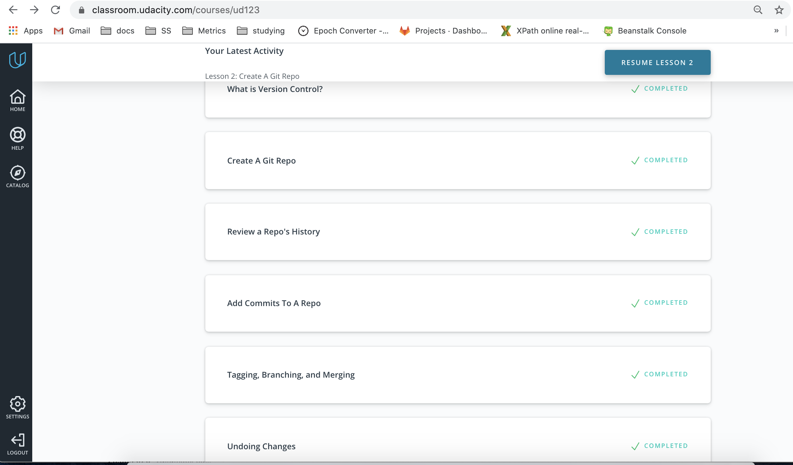
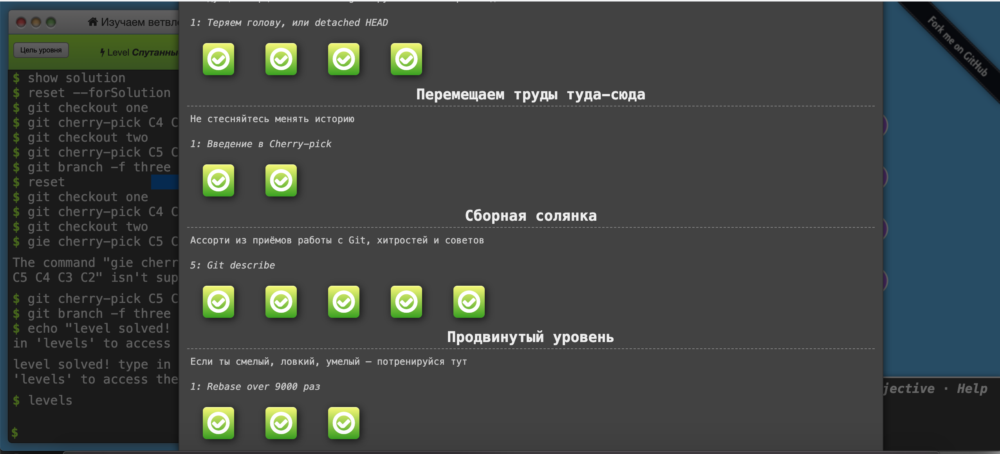
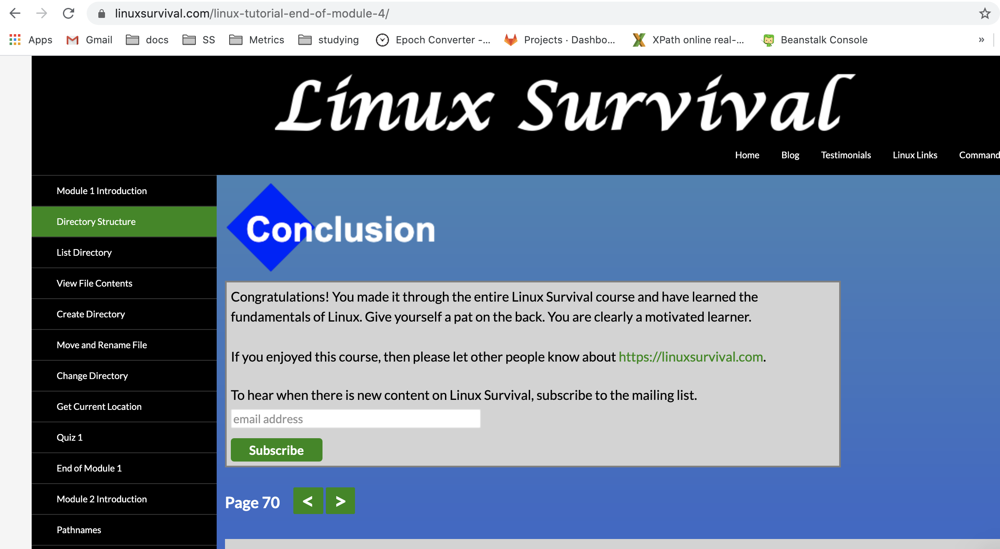

# kottans-frontend

As I already know basics, I'll include here some new things that I learned 

## Git intro
### I learned that:
* We can use `git log --oneline` to see only hash and commit
* `git log --stat` shows the number of insertions and deletions in a file
* `git log -p` or `--patch` displays actual changes to the file
* The `git show` command will show only one commit
* Flag `-w` ignores whitespaces 
* We can create a new branch from a commit using `git branch <name> hash`
* The `--decorate` flag makes git log display all of the references (e.g., branches, tags, etc) that point to each commit
* The `--graph` flag adds the bullets and lines to the leftmost part of the output
* The `--all` flag is what displays all of the branches in the repository
* `git merge <other-branch>` is used to merge a branch into a master
* `git revert <SHA-of-commit-to-revert>` to revert a commit
* `git reset` leaves changes in the working directory, `git reset soft` leaves them in staging index, `git reset hard` deletes them

<details>
  <summary>VCS with Git</summary>
  
</details>
<details>
  <summary>Main</summary>
  
</details>
<details>
  <summary>Remote</summary>
  
</details>

## Linux CLI, and HTTP
### I learned that:
* We can use ls -l to display detailed ls
* We can give different permissions to files using  chmod to add permissions to groups or users
* We can use ~ instead of home dir
* We use `find <directory> name <filename>` to look for files
* We use `cat` to concatinate files
* We use `lpr, lpq, lprm` for printer
* `df` shows space left on the computer
* `-r ` stands for recursive and can be used for copying or removing files
* We use `ps aux` to see all the processes
<details>
  <summary>Linux</summary>
  
</details>

## Git Collaboration
### I learned:
* What means forking the repository and how it works on github
* It's possible to add all the files in the directory to the commit using git add .
* To create a new branch we need to use `git push origin <branchname>`
* Git `shortlog` command
* We can use `git log --author=` to specify the author
* We can use `git log --grep=` for looking for commints by words
* There exist a `CONTRIBUTING.md`  file 
* It's possible to star a repository or to watch it on github
* It's possible to use `git remote add upstream` and use with forked project
* It's possible to rename origin with `git remote rename <name> origin`
* We can use `git rebase` to squash commits together

## Intro to HTML and CSS
### HTML codeacademy:
#### Tables:

<table>
  <thead> 
    <tr>
     <th scope="col">Element</th>
     <th scope="col">Function</th>
     </tr>
   </thead> 
   <tbody>
    <tr>
      <td>table</td>
      <td>creates a table</td>
    </tr>`
     <tr>
      <td>tr</td>
      <td>adds rows</td>
    </tr>
     <tr>
      <td>td</td>
      <td>adds data to the row</td>
    </tr>
     <tr>
      <td>th</td>
      <td>adds a heading using the scope attribute that can be col or row</td>
    </tr>
     <tr>
      <td>rowspan</td>
      <td>span rows together</td>
    </tr>
     <tr>
      <td>rowspan and colspan</td>
      <td>span rows or columns together</td>
    </tr>
     <tr>
      <td>thread</td>
      <td>creates a heading</td>
    </tr>
      <tr>
      <td>tbody</td>
      <td>creates a body</td>
    </tr>
      <tr>
      <td>tfooter</td>
      <td>creates a footer</td>
    </tr>
</table>

#### Forms:

Create a text field:

```html
<section class="protein">
  <label for="patty">What type of protein would you like?</label>
  <input type="text" name="patty" id="patty">
</section>
```
It may contain "text", "password", "number" 
Create a slidebar:
```html
<section class="cooked">
 <label for="doneness">How do you want your patty cooked</label>
 <input type="range" name="doneness" id="doneness" value="3" min="1" max="5">
</section>
```
Create a checkbox:
```html
<section class="toppings">
 <span>What toppings would you like?</span>
 <input type="checkbox" name="topping" id="lettuce" value="lettuce">
 <label for="lettuce">Lettuce</label>
</section>
```
Create radiobuttons:
```html
<span>Would you like to add cheese?</span>
  <input type="radio" name="cheese" id="yes" value="yes">
  <label for="yes">Yes</label>
  <input type="radio" name="cheese" id="no" value="yes">
  <label for="no">No</label>
```
Create a dropdown list:
```html
<section class="bun-type">
  <label for="bun">What type of bun would you like?</label>
  <select name="bun" id="bun">
     <option value="sesame">Sesame</option>
     <option value="potatoe">Potato</option>
     <option value="pretzel">Pretzel</option>
   </select>
</section>
```
Create a text field where you can type and choose from the list:
```html
<section class="sauce-selection">
  <label for="sauce">What type of sauce would you like?</label>
  <input list="sauces" id="sauce" name="sauce">
  <datalist id="sauces">
     <option value="ketchup"></option>
     <option value="mayo"></option>
     <option value="mustard"></option>
   </datalist>
</section>
```
Create a text input field:
```html
<section class="extra-info">
  <label for="extra">Anything else you want to add?</label>
  <textarea id="extra" name="extra" rows="3" cols="40"></textarea>
</section>
```
Create a submit button:
```html
<section class="submission">
 <input type="submit" value="Submit">
</section>
```
